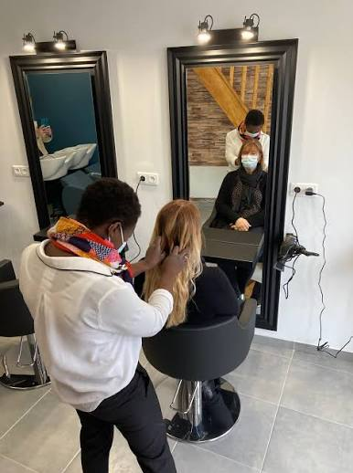

# Tiote Beauté — Site vitrine premium

Site vitrine multipage (6 pages) pour un salon de coiffure haut de gamme.
HTML / CSS / JavaScript **sans build**, prêt à héberger.



## ✨ Points forts
- **6 pages** : Accueil, Le salon, Prestations & tarifs, Galerie, Avis, Contact
- Design luxe : noir profond / doré / anthracite, typographies Playfair Display + Inter
- **Animations sophistiquées** : défilement fluide (Lenis), révélations GSAP ligne par ligne, zoom & parallaxe au scroll, fond évolutif, curseur personnalisé, boutons magnétiques
- **Carrousel avant/après** draggable · **carrousel d'avis Google** · galerie **lightbox**
- **33 visuels SVG générés** sur mesure (aucune dépendance image externe)
- Responsive · mode sombre/clair · SEO local + données structurées `HairSalon` · boutons WhatsApp/appel

## 🚀 Lancer en local
```bash
python -m http.server 5566
```
Puis ouvrir http://localhost:5566

## 🗂 Structure
```
├── index.html · salon.html · prestations.html · galerie.html · avis.html · contact.html
├── css/style.css        # identité + composants + animations
├── js/main.js           # expérience (scroll, curseur, carrousels, lightbox…)
├── gen_svg.py           # générateur des visuels SVG
└── assets/img/          # 3 photos réelles + 33 visuels générés
```

## 🔧 À personnaliser
Voir **[LISEZ-MOI.md](LISEZ-MOI.md)** : vidéo hero, module de réservation (Planity/Booksy/Calendly),
téléphone, adresse, ville (SEO local), avis Google, liens réseaux sociaux.

---
Développé pour **Tiote Beauté**.
